# The explorer

`intent explore` opens a project in your terminal: its threads, their work packages, criteria and tests, and its issues. You get around by typing into one box rather than by learning keys, and when something else writes to the project, the screen catches up by itself.

This page is organised by task, and it deliberately has no key table. Inside the explorer, `/help` lists every key, command and setting, and it is built from the same declarations the explorer runs on, so it cannot fall behind the way a copy here would.

The screens below are taken from the explorer itself by `intent/st/ST0056/parity/tools/gen_explorer_shots.sh`, on two small demo projects, `shopfront` and `warehouse`. The version and commit at the right of the status row are shown as `...`.

## Open it

Run it from inside a project:

```
  $ cd shopfront
  $ intent explore
```

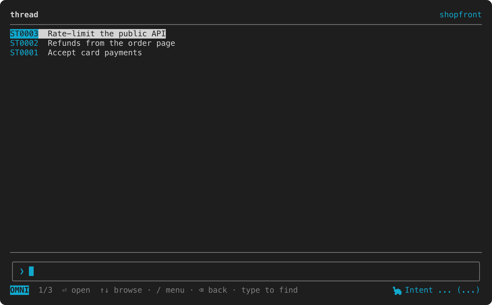

It opens at the top of the project, on its threads, newest first. The header names the view on the left and the project on the right. The box at the bottom is where you type. The status row under it shows the mode you are in (`OMNI`, `MENU` or `EDIT`), where you are in the list, and the keys that act here.

To open at one of the explorer's views, name it as you would type its command:

```
  $ intent explore issues
  $ intent explore outstanding
  $ intent explore projects
```

The views are `threads`, `issues`, `projects`, `outstanding`, `help`, `settings` and `search`. The start of a name is enough when only one view starts that way, so `intent explore outs` opens `outstanding`. The explorer opens exactly as if you had typed `/issues` into it, so Backspace takes you back to the top. When the start fits two views, such as `se` for `settings` and `search`, it opens at the top and the status row names both.

To open somewhere other than the top, give it an id or a full address:

```
  $ intent explore ST0001
  $ intent explore intent:///issues/0001
  $ intent explore intent:///threads/ST0001/wp/02
```

A thread can be named `ST0001`, `ST1` or `st1`. A bare number, such as `4`, opens the one thread or issue in the project with that number; when a thread and an issue share it, say which you mean with `s4` or `i4`. A number that names both or neither, or an address it cannot open, leaves you at the top instead, and the status row says why.

**Outside a project, `intent explore` opens the list of projects this machine knows.** It adds each project it opens to that list, and `intent discover <dir>` adds every project under a directory.

It needs a terminal. With its output going anywhere else, it refuses:

```
  $ intent explore | cat
  error: `intent explore` needs a terminal, and stdout is not one.
    remedy: run it in a terminal, or use `intent st list` and `intent edit <kind> <id> --path` for a pipe
```

To leave, press Ctrl-C from anywhere, or run `/quit`.

## Find a thread or an issue

Type in the box. The matches narrow as you type, drawn from every thread and issue in the project by id and title, and the best one sits nearest the box:

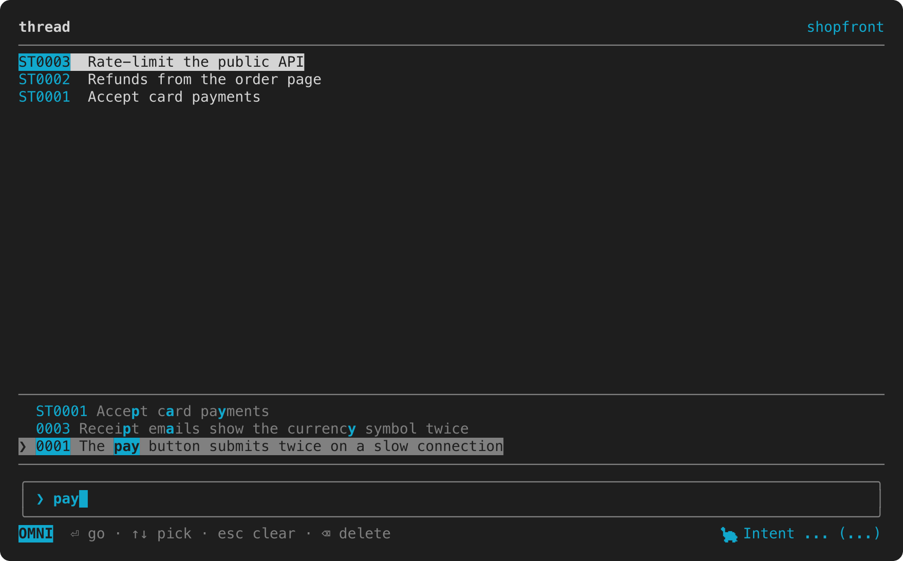

The up and down arrows move between the matches, Enter opens the one selected, and Esc clears the box.

## Read a thread

Enter on a row opens it. A thread's fields fill the top of the screen, and the field you select is shown in full in the pane below, rendered as markdown:

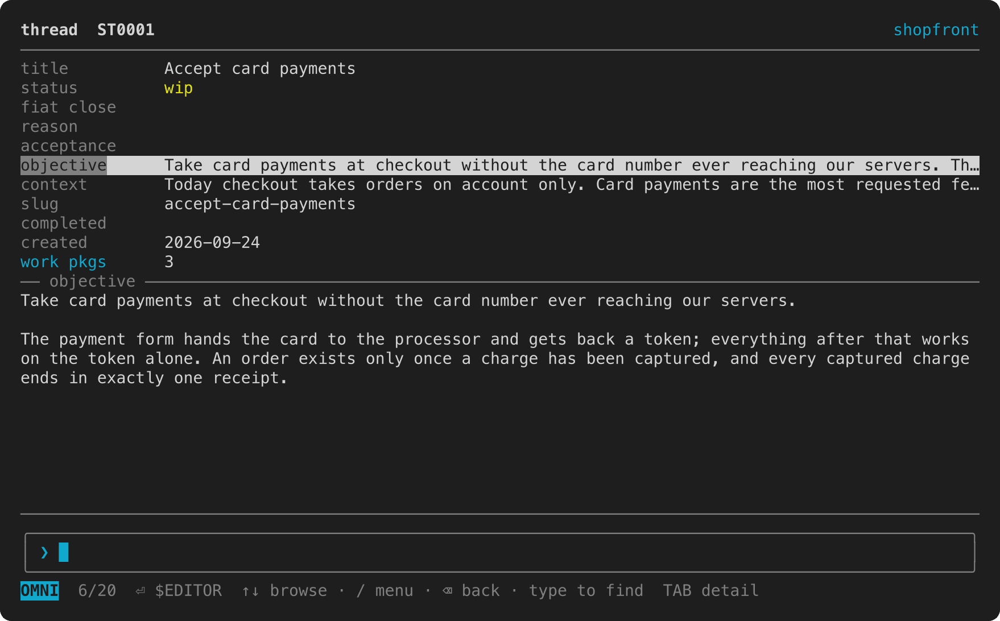

A field too long for the pane scrolls: Tab moves into the pane, and Tab again moves back.

Some rows lead further. `work pkgs`, `criteria` and `tests` open their lists, and the pane then shows the item you select. A criterion shows whether it is satisfied and which tests cover it:

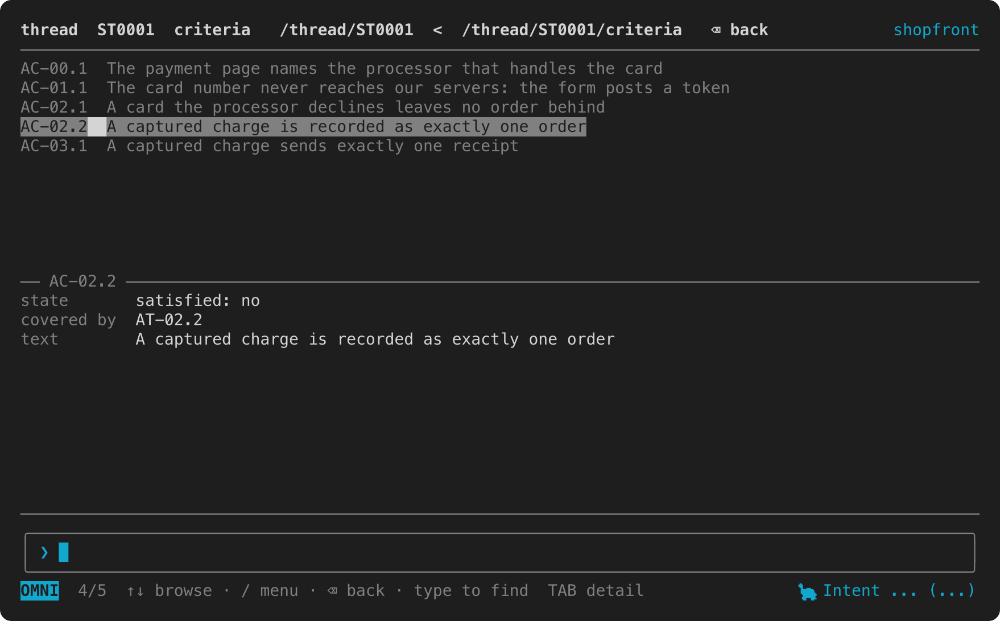

With the box empty, Backspace goes back one view. The header traces the views you came through, the one you are on last.

## Change a field

Enter on a short field edits it in place. Enter again saves the change, and Esc throws it away:

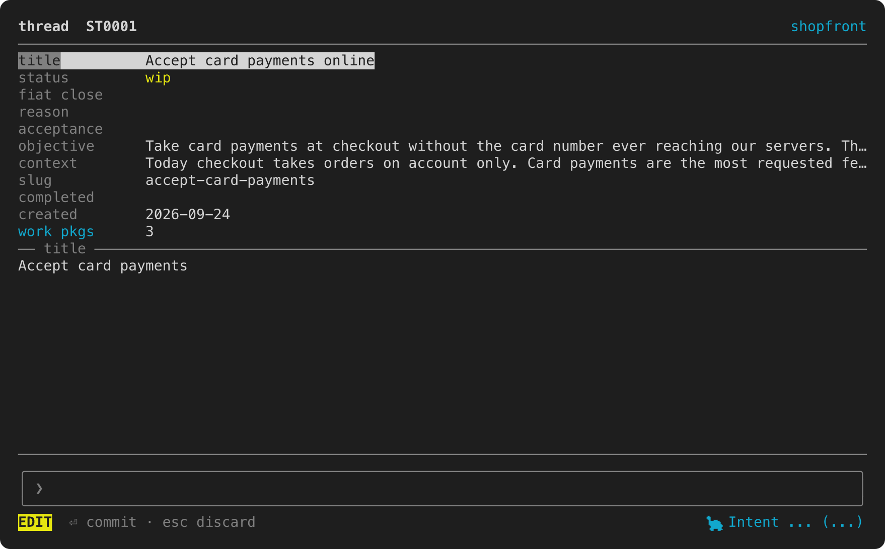

The line editor takes emacs keys unless you switch it to vi, under [Settings](#settings).

Enter on a prose field, such as an objective or a context, opens it in your editor: `$VISUAL`, or `$EDITOR` when `$VISUAL` is unset. When the editor exits, the explorer reads the file back and saves the field. With neither variable set, it says so on the status row and changes nothing.

An edit made here is written to the project's store like any other, so `intent st show` prints it at once.

A thread's files have rows of their own, and each row says who writes that file. A generated one, such as `info.md` or `acceptance.md`, cannot be edited here: Enter says why, and the row names the command that writes it. An authored one, such as `design.md`, opens in your editor once the thread carries it, and `intent st attach` is how a thread gets one.

## Run a command

With the box empty, `/` opens the menu. Type to filter it, press Enter to run the command selected, or press Esc to close it:

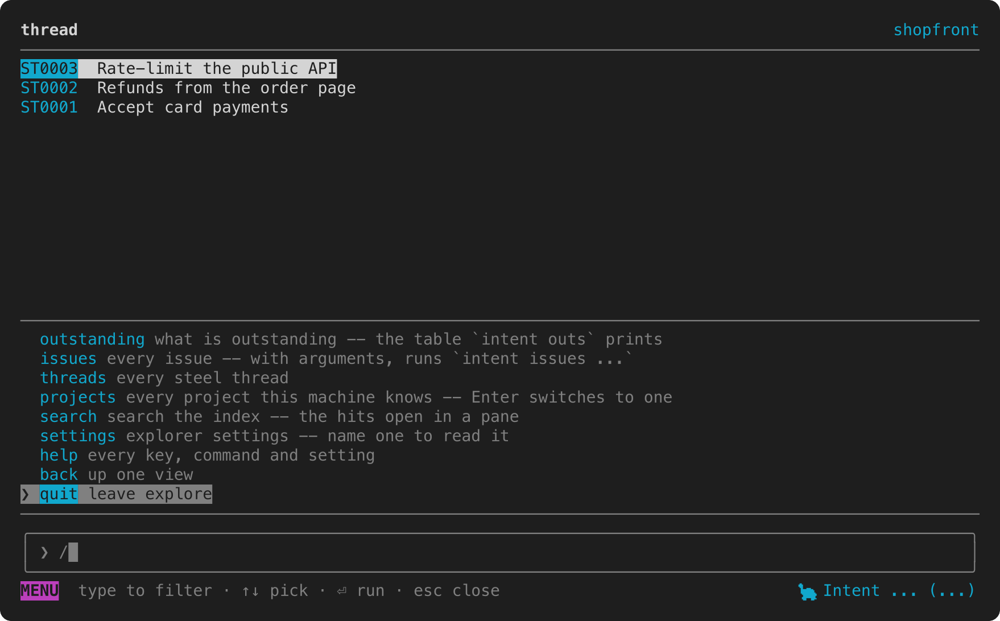

Intent's own commands run from the menu as well, as `/` followed by the command, such as `/todo` or `/st list`. The explorer lends the terminal to the command, which prints as it would at a prompt, and then waits for Enter to bring you back. `/help` lists the commands that run this way with a leading `/`.

## See what is outstanding

`/outstanding`, or `/outs`, shows the table `intent outs` prints: the threads and work packages in progress, and the open issues.

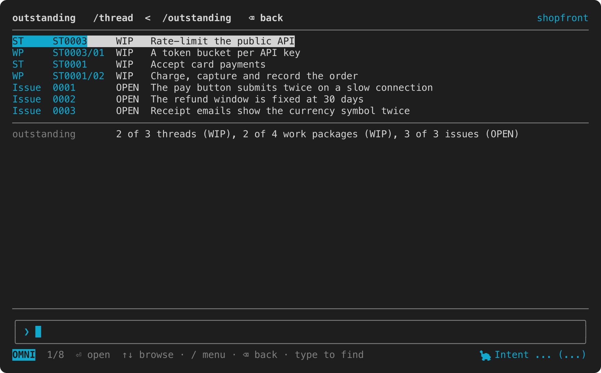

Enter on a row opens the thread, work package or issue it names.

## Search the project

`/search` followed by some text searches the project's index and lists the hits in a pane. Enter on a hit opens it:

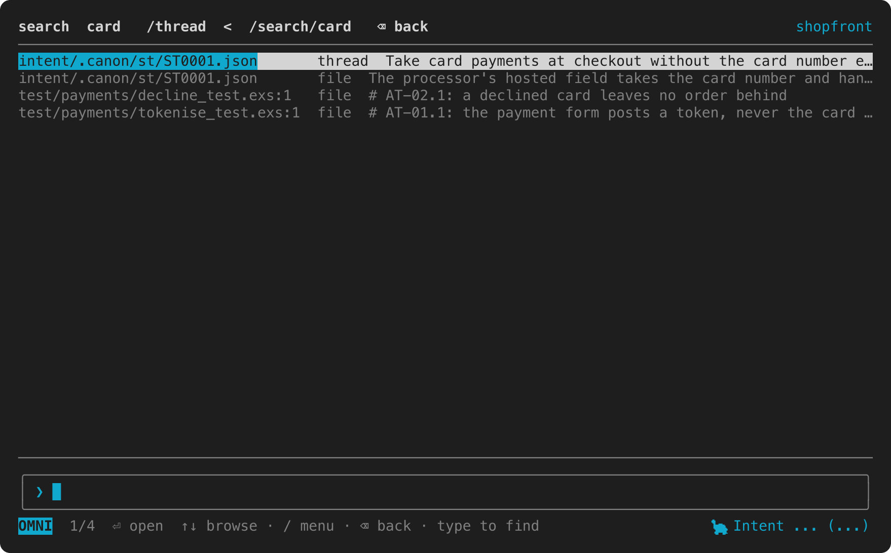

The search pane is the one view that does not follow the store. Its answer is the index's when you open the pane, so open it again to search afresh. When the index is incomplete or out of date, the status row says so, and when nothing is indexed yet it warns that an empty result proves nothing.

## Keep up without pressing a key

Every view except the search pane follows the project's store. When something else writes to it, such as a command in another terminal or an agent working beside you, the screen catches up within half a second:

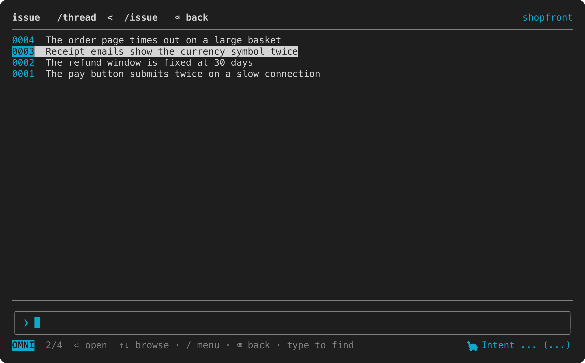

Issue 0004 in that screen was added from another terminal while the list was open, and no key was pressed after it.

Two things wait for you. A field you are editing is never changed under you: the view catches up once you have saved or discarded it. And new threads and issues join the box's matches only while the box is empty, so the list you are picking from never shifts under you.

## Switch projects

`/projects` lists every project this machine knows. Enter opens the one selected, in place of the one you are in:

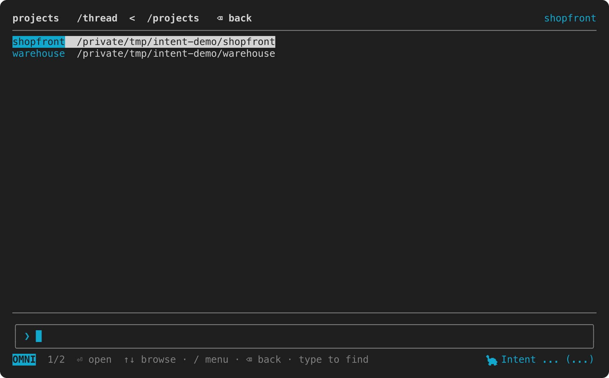

## Settings

`/settings` lists the explorer's settings. Enter on one moves it to its next value, and the status row shows what it is now. `/settings <name>` reads one setting without changing it.

Settings are yours rather than the project's. They live in the `explorer` section of `$XDG_CONFIG_HOME/intent/config.json`, which is `~/.config/intent/config.json` unless you have moved it, so they follow you from project to project.

## Every key, command and setting

`/help` lists them all, grouped by mode, with what each one does:

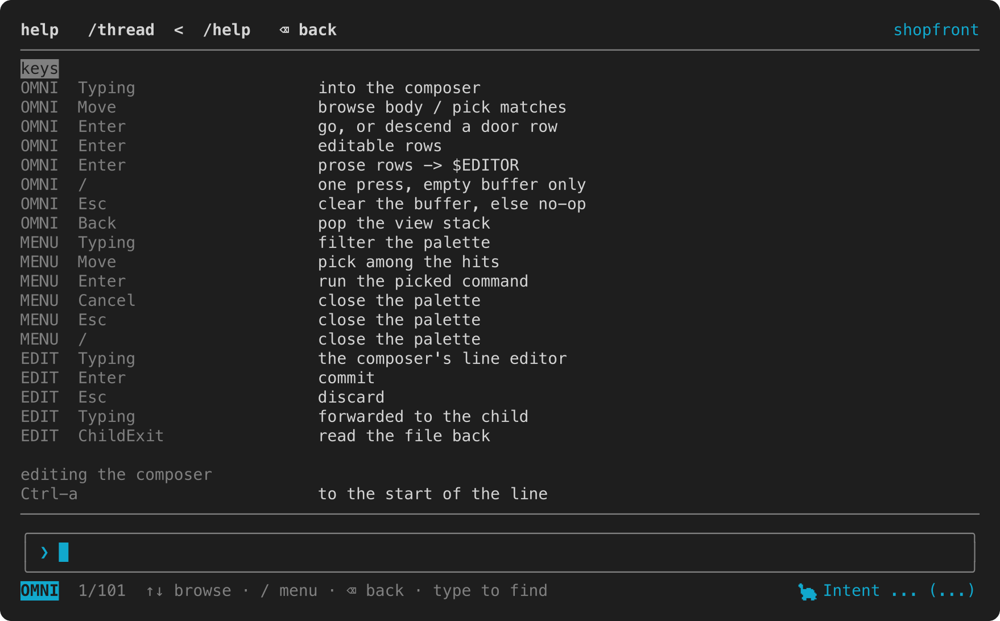

`/help` followed by one of Intent's commands shows that command's own help, so `/help st` shows what `intent st --help` prints.
